# Fake Review & Fraud Detection System

A comprehensive AI-powered system for detecting fake reviews and fraud in e-commerce platforms. Built with FastAPI, Transformers, and fine-tuned BERT models with advanced multi-signal analysis.

## 🚀 Features

- **🤖 AI-Powered Detection**: Uses fine-tuned BERT models for accurate fake review detection
- **🔍 Multi-Signal Analysis**: Combines AI model (60%), behavioral analysis (30%), and text heuristics (10%)
- **📊 Real-time Analysis**: Analyze individual reviews or batch upload CSV files
- **🎯 Fine-tuning Capability**: Train models on your specific dataset for better accuracy
- **✅ Comprehensive Validation**: Robust evaluation metrics and testing
- **🌐 Modern Web Interface**: Multi-page responsive frontend with a beautiful, consistent navigation bar
- **📈 Batch Processing**: Handle large datasets with range selection
- **🧪 Accuracy Testing**: Test system performance on labeled datasets
- **👤 Behavioral Analysis**: User pattern detection, timing analysis, and rating patterns
- **📝 Advanced Heuristics**: Text complexity, repetition detection, and suspicious patterns
- **🔧 Automated Setup**: One-click installation and setup via script runner

## 🏗️ System Architecture

```mermaid
---
config:
  layout: dagre
---
flowchart TD

    %% User Interface Layer
    UI[🌐 Frontend Interface
    *HTML5, CSS3, JavaScript*
    <u>Multi-page responsive web app</u>
    **Single Review, Batch Analysis, Accuracy Testing, Fine-tuning**] --> API

    %% API Gateway Layer
    API[🚀 FastAPI Backend Server
    *RESTful API Gateway*
    <u>Request routing & validation</u>
    **CORS, Static file serving, JSON responses**] --> ML_ENGINE

    %% Core Processing Layer
    ML_ENGINE[🤖 ML Engine
    *Fine-tuning & Model Management*
    <u>BERT model training & validation</u>
    **Hugging Face Transformers, PyTorch**] --> BEHAVIORAL

    BEHAVIORAL[👤 Behavioral Analyzer
    *User pattern detection*
    <u>Review frequency, timing, rating patterns</u>
    **Custom Python module**] --> HEURISTICS

    HEURISTICS[📝 Text Heuristics
    *Suspicious pattern detection*
    <u>Excessive punctuation, repetition, complexity</u>
    **Regex patterns & NLP analysis**] --> COMBINER

    %% Data Sources
    DATASET[📊 Training Dataset
    *CSV files with labeled reviews*
    <u>OR=Real, CG=Fake labels</u>
    **Kaggle datasets, custom data**] --> ML_ENGINE

    MODEL_STORE[💾 Model Storage
    *Fine-tuned BERT models*
    <u>config.json, model.safetensors, tokenizer</u>
    **Local file system**] --> ML_ENGINE

    %% Multi-Signal Analysis
    COMBINER[⚖️ Multi-Signal Combiner
    *Weighted scoring system*
    <u>AI Model 60% + Behavioral 30% + Heuristics 10%</u>
    **Dynamic threshold adjustment**] --> RESULTS

    %% Output Layer
    RESULTS[📈 Analysis Results
    *Comprehensive fraud detection*
    <u>Fraud score, confidence, recommendations</u>
    **JSON response with detailed breakdown**] --> UI

    %% External Services
    SENTIMENT[😊 Sentiment Analysis
    *DistilBERT pipeline*
    <u>Emotional content analysis</u>
    **Hugging Face Transformers**] --> COMBINER

    %% Script Runner
    SCRIPT[🔧 Script Runner
    *Automated setup & operations*
    <u>One-click installation & deployment</u>
    **Python automation**] --> API

    %% Styling
    classDef frontend fill:#e1f5fe,stroke:#01579b,stroke-width:2px
    classDef backend fill:#f3e5f5,stroke:#4a148c,stroke-width:2px
    classDef ml fill:#e8f5e8,stroke:#1b5e20,stroke-width:2px
    classDef data fill:#fff3e0,stroke:#e65100,stroke-width:2px
    classDef output fill:#fce4ec,stroke:#880e4f,stroke-width:2px

    class UI,SCRIPT frontend
    class API backend
    class ML_ENGINE,BEHAVIORAL,HEURISTICS,SENTIMENT ml
    class DATASET,MODEL_STORE data
    class RESULTS,COMBINER output
```



### 🔄 Data Flow Architecture

```mermaid
---
config:
  layout: dagre
---
flowchart LR

    %% Input Sources
    subgraph INPUTS["📥 Input Sources"]
        SINGLE[Single Review Input]
        BATCH[Batch CSV Upload]
        LABELED[Labeled Dataset]
    end

    %% Processing Pipeline
    subgraph PROCESSING["⚙️ Processing Pipeline"]
        VALIDATE[Data Validation]
        TOKENIZE[Text Tokenization]
        AI_MODEL[AI Model Analysis]
        BEHAVIOR[Behavioral Analysis]
        HEURISTIC[Heuristic Analysis]
    end

    %% Model Layer
    subgraph MODELS["🤖 AI Models"]
        BERT[BERT-tiny Base Model]
        FINE_TUNED[Fine-tuned BERT]
        SENTIMENT[DistilBERT Sentiment]
    end

    %% Analysis Components
    subgraph ANALYSIS["🔍 Analysis Components"]
        TEXT_ANALYSIS[Text Pattern Analysis]
        USER_BEHAVIOR[User Behavior Patterns]
        TIMING[Timing Analysis]
        RATING[Rating Pattern Analysis]
    end

    %% Output Generation
    subgraph OUTPUTS["📤 Output Generation"]
        SCORE[Fraud Score Calculation]
        BREAKDOWN[Multi-Signal Breakdown]
        RECOMMENDATION[Action Recommendations]
        METRICS[Performance Metrics]
    end

    %% Data Flow
    INPUTS --> VALIDATE
    VALIDATE --> TOKENIZE
    TOKENIZE --> AI_MODEL
    AI_MODEL --> BEHAVIOR
    BEHAVIOR --> HEURISTIC
    HEURISTIC --> SCORE

    %% Model Integration
    BERT --> AI_MODEL
    FINE_TUNED --> AI_MODEL
    SENTIMENT --> TEXT_ANALYSIS

    %% Analysis Integration
    TEXT_ANALYSIS --> SCORE
    USER_BEHAVIOR --> SCORE
    TIMING --> SCORE
    RATING --> SCORE

    %% Final Output
    SCORE --> BREAKDOWN
    BREAKDOWN --> RECOMMENDATION
    SCORE --> METRICS

    %% Styling
    classDef input fill:#e3f2fd,stroke:#1565c0,stroke-width:2px
    classDef process fill:#f3e5f5,stroke:#7b1fa2,stroke-width:2px
    classDef model fill:#e8f5e8,stroke:#2e7d32,stroke-width:2px
    classDef analysis fill:#fff3e0,stroke:#f57c00,stroke-width:2px
    classDef output fill:#fce4ec,stroke:#c2185b,stroke-width:2px

    class SINGLE,BATCH,LABELED input
    class VALIDATE,TOKENIZE,AI_MODEL,BEHAVIOR,HEURISTIC process
    class BERT,FINE_TUNED,SENTIMENT model
    class TEXT_ANALYSIS,USER_BEHAVIOR,TIMING,RATING analysis
    class SCORE,BREAKDOWN,RECOMMENDATION,METRICS output
```



## 📁 Project Structure

```
Fake-Review-and-Fraud-Detection/
├── README.md                    # 📖 Documentation
├── requirements.txt             # 🐍 Dependencies (auto-installed)
├── fine_tuned_model/           # 🤖 Fine-tuned model (auto-generated)
│   ├── config.json
│   ├── model.safetensors
│   ├── tokenizer.json
│   └── ... (other model files)
├── src/                        # 🔧 Backend & ML code
│   ├── main.py                # FastAPI backend server
│   ├── ml_engine.py           # ML engine (fine-tuning, validation)
│   ├── behavioral_analyzer.py # Behavioral analysis module
│   └── run_scripts.py         # Script runner (all operations)
├── frontend/                   # 🎨 Frontend code
│   ├── index.html             # Home page (single review analysis)
│   ├── batch.html             # Batch analysis page
│   ├── accuracy.html          # Accuracy testing page
│   ├── fine_tune.html         # Fine-tuning interface
│   ├── about.html             # About page
│   └── styles.css             # Modern CSS styling
└── datasets/                   # 📊 Dataset storage
    └── fake reviews dataset.csv # Labeled dataset for training
```

## 🛠️ Quick Start

### 🎯 Recommended: Use the Script Runner (One-Click Setup)

The easiest way to get started is using the automated script runner:

```bash
# Clone the repository
git clone https://github.com/ryanlau1220/Fake-Review-and-Fraud-Detection.git
cd Fake-Review-and-Fraud-Detection

# Run the script runner
cd src
python run_scripts.py
```

This provides a menu-driven interface that will:
- ✅ Automatically install all dependencies
- 🚀 Start the backend server
- 🌐 Open the frontend in your browser
- 🎯 Guide you through all operations

### 📋 Available Operations

When you run `python run_scripts.py`, you'll see these options:

1. **Install Dependencies** - Automatically installs all required packages
2. **Start Backend Server** - Launches the FastAPI server on http://127.0.0.1:8000
3. **Start Frontend** - Opens the web interface in your browser
4. **Run Fine-tuning** - Train the model on your dataset for better accuracy
5. **Run Validation** - Test model performance on labeled data
6. **Run Complete System** - Start both backend and frontend together
7. **Run Full Pipeline** - Complete workflow from data to trained model

### 🔄 Alternative: Manual Setup (Advanced Users)

If you prefer manual control:

```bash
# Clone the repository
git clone https://github.com/ryanlau1220/Fake-Review-and-Fraud-Detection.git
cd Fake-Review-and-Fraud-Detection

# Install dependencies (optional - run_scripts.py handles this automatically)
pip install -r requirements.txt

# Start backend server
cd src
python -m uvicorn main:app --host 127.0.0.1 --port 8000 --reload

# Open browser to http://127.0.0.1:8000
```

## 🎯 Usage Guide

### 1. Single Review Analysis
- Navigate to the Home page
- Enter review text, username, and optional behavioral data
- Get instant fraud score with multi-signal breakdown
- View AI model, behavioral, and heuristic scores

### 2. Batch Processing
- Go to Batch Analysis page
- Upload CSV file with reviews
- Select range to analyze (e.g., 0-100)
- Get comprehensive results table

### 3. Accuracy Testing
- Visit Accuracy Testing page
- Upload labeled dataset (OR=Real, CG=Fake)
- Select range for testing
- View detailed performance metrics and confusion matrix

### 4. Fine-tuning (Improve Accuracy)
```bash
# Run fine-tuning via script runner
python run_scripts.py
# Choose option 4: Run Fine-tuning
```
**Expected improvement**: 45% → 80-90% accuracy

### 5. Validation Testing
```bash
# Run validation via script runner
python run_scripts.py
# Choose option 5: Run Validation
```

## 📊 Performance Metrics

### Before Fine-tuning
- Accuracy: ~45%
- Precision: ~0.10
- Recall: ~0.10

### After Fine-tuning (Current Performance)
- **Accuracy: ~81%**
- **Precision: ~93%**
- **Recall: ~71%**
- **F1-Score: ~81%**

## 🔧 Technical Details

### Multi-Signal Detection System
The system combines three detection methods:

1. **🤖 AI Model (60% weight)**: Fine-tuned BERT model for text classification
2. **👤 Behavioral Analysis (30% weight)**: User patterns, timing, review frequency
3. **📝 Text Heuristics (10% weight)**: Suspicious patterns, complexity analysis

### Models Used
- **Base Model**: BERT-tiny (fast, efficient)
- **Fine-tuned**: Custom model trained on your dataset
- **Sentiment**: DistilBERT for sentiment analysis
- **Behavioral**: Custom behavioral analysis engine

### Features Analyzed
- **Text Analysis**: Language patterns, complexity, suspicious phrases
- **User Behavior**: Review count, timing patterns, rating consistency
- **Sentiment Analysis**: Emotional content and sentiment shifts
- **Heuristic Signals**: Exclamation marks, repetition, generic language
- **AI Confidence**: Model prediction confidence scores

### API Endpoints
- `GET /` - Home page (single review analysis)
- `GET /batch` - Batch analysis page
- `GET /accuracy` - Accuracy testing page
- `GET /fine_tune` - Fine-tuning interface
- `GET /about` - About page
- `POST /analyze_review` - Single review analysis
- `POST /analyze_reviews_batch` - Batch analysis
- `POST /analyze_reviews_csv` - CSV file processing
- `POST /calculate_accuracy` - Accuracy testing
- `POST /analyze_labeled_csv` - Labeled dataset analysis
- `GET /test_fake_model` - Model status check

## 🎨 Frontend Features

### Modern Multi-Page Interface
- **🏠 Home**: Single review analysis with multi-signal breakdown
- **📊 Batch Analysis**: CSV upload with range selection
- **🎯 Accuracy Testing**: Performance evaluation with detailed metrics
- **🔧 Fine-tuning**: Model training interface
- **ℹ️ About**: System information and documentation

### UI/UX Features
- **Consistent Navigation Bar**: Modern, full-width navigation bar present on all pages
- **Responsive Design**: Works on desktop, tablet, and mobile
- **Modern Styling**: Clean, minimalist design with vibrant colors
- **Interactive Elements**: Smooth animations and transitions
- **Real-time Feedback**: Instant analysis results
- **Visual Indicators**: Color-coded fraud scores and status
- **Mobile Navigation**: Hamburger menu for mobile devices

### Advanced Features
- **Model Status Display**: Shows if fine-tuned model is loaded
- **Range Selection**: Choose which reviews to analyze
- **Detailed Results**: Comprehensive analysis breakdown
- **Performance Metrics**: Accuracy, precision, recall, F1-score
- **Confusion Matrix**: Visual representation of predictions

## 🔍 Advanced Features

### Behavioral Analysis
- **User Review Patterns**: Frequency and timing analysis
- **Rating Consistency**: Check for suspicious rating patterns
- **Account Age**: New vs. established user analysis
- **Text Similarity**: Detect duplicate or similar reviews
- **Timing Analysis**: Suspicious posting patterns

### Heuristic Analysis
- **Excessive Punctuation**: Too many exclamation marks or questions
- **Word Repetition**: Detect repetitive language patterns
- **Text Complexity**: Analyze vocabulary diversity
- **Generic Language**: Identify overly generic phrases
- **All-Caps Detection**: Suspicious capitalization patterns

### Confidence Scoring
- **Dynamic Weighting**: Adjusts based on available data
- **Model Confidence**: AI model prediction confidence
- **Combined Scoring**: Weighted combination of all signals
- **Adaptive Thresholds**: Different thresholds for different models

## 📈 Fine-tuning Process

### Why Fine-tuning?
The pre-trained model was trained on general fake news, but e-commerce reviews have different characteristics. Fine-tuning adapts the model to your specific domain.

### Process
1. **Data Preparation**: Load labeled dataset (OR=Real, CG=Fake)
2. **Training**: Update model parameters on your data
3. **Evaluation**: Test on holdout set
4. **Deployment**: Automatically use improved model

### Dataset Format
```csv
text,label
"This product is great!",OR
"This is a fake review",CG
```

## 🧪 Validation and Testing

### Validation Features
- **Confusion Matrix**: True/false positives and negatives
- **Sample Predictions**: Examples of correct/incorrect classifications
- **Confidence Analysis**: Model confidence scores
- **Detailed Metrics**: Accuracy, precision, recall, F1-score
- **Label Distribution**: Analysis of dataset balance

### Testing Workflow
1. Split dataset into training/validation sets
2. Train model on training data
3. Evaluate on validation data
4. Show comprehensive results with debugging info

## 🚨 Troubleshooting

### Common Issues
1. **Out of Memory**: Reduce batch size in fine-tuning
2. **Slow Performance**: Use smaller model or fewer epochs
3. **Poor Accuracy**: Check dataset quality and labels
4. **Model Not Loading**: Ensure fine-tuned model exists
5. **404 Errors**: Restart backend after changes

### Performance Tips
- Use GPU for faster fine-tuning
- Balance your dataset (similar real/fake counts)
- Clean your data (remove very short/long reviews)
- Use consistent labeling (OR vs CG)
- Test with smaller ranges first

## 📚 Technical Stack

- **Backend**: FastAPI, Python
- **ML Framework**: Hugging Face Transformers
- **Models**: BERT, DistilBERT
- **Frontend**: HTML5, CSS3, JavaScript
- **Data Processing**: Pandas, Scikit-learn
- **Behavioral Analysis**: Custom Python module

## 🤝 Contributing

This is a hackathon project demonstrating:
- **AI/ML expertise**: Fine-tuning and multi-signal analysis
- **Full-stack development**: Backend API + Modern frontend
- **Real-world problem solving**: E-commerce fraud detection
- **Performance optimization**: Balanced accuracy and speed

## 📄 License

This project is part of a hackathon submission and is provided as-is for educational and demonstration purposes.
